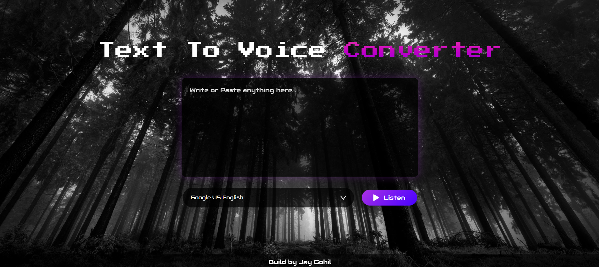

# 🎙️ Text To Voice Converter

A sleek and simple web application that converts text to speech with multiple voice options. Built with vanilla JavaScript using the Web Speech API.



## ✨ Features

- **Multiple Voice Options**: Choose from various system voices
- **Clean Interface**: Modern, cyberpunk-inspired design
- **Instant Conversion**: Real-time text-to-speech conversion
- **Responsive Design**: Works on both desktop and mobile devices
- **Easy to Use**: Simple paste and play functionality

## 💻 Tech Stack

- HTML5
- CSS3 with custom animations
- Vanilla JavaScript
- Web Speech API
- Google Fonts (Audiowide, Press Start 2P)

## 📂 Project Structure

```
text-to-voice/
│
├── index.html
├── edit.css
├── script.js
└── images/
    ├── play.png
    └── bg.jpg
```

## 🛠️ How It Works

The application uses the Web Speech API to convert text to speech:

```javascript
// Initialize speech synthesis
let speech = new SpeechSynthesisUtterance();
let voices = [];

// Load available voices
window.speechSynthesis.onvoiceschanged = () => {
   voices = window.speechSynthesis.getVoices();
   speech.voice = voices[0];
   // Populate voice selection dropdown
   voices.forEach((voice, i) => (voiceSelect.options[i] = new Option(voice.name, i)));
};
```

## 📖 Usage

1. Open `index.html` in your web browser
2. Type or paste text into the textarea
3. Select your preferred voice from the dropdown
4. Click "Listen" to hear the text spoken

## 🎯 Key Components

### HTML Structure
```html
<div class="hero">
    <div class="top">
        <h1>Text To Voice <span>Converter</span></h1>
    </div>
    <textarea placeholder="Write or Paste anything here..."></textarea>
    <div class="row">
        <select></select>
        <button> Listen </button>
    </div>
</div>
```

### Voice Selection
The application automatically detects and loads all available system voices into the dropdown menu. Users can switch between different voices at any time.

### Speech Synthesis
Text-to-speech conversion is handled by the Web Speech API, which provides natural-sounding voice output across different browsers and platforms.

## 🌐 Browser Compatibility

Works best in:
- Google Chrome
- Microsoft Edge
- Safari
- Firefox

> Note: Voice availability may vary depending on your system and browser.

## ⚙️ Setup

1. Download the project files
2. Ensure all files are in the same directory
3. Open `index.html` in your web browser

No additional installation or setup required!

## 🐛 Troubleshooting

**No voices appearing in dropdown?**
- Make sure you're using a supported browser
- Allow the page to fully load
- Check if your browser supports Web Speech API

**No sound playing?**
- Check your system volume
- Ensure no other apps are blocking audio
- Try refreshing the page

## 👨‍💻 Developer

Built by [Jay Gohil](https://hasithaonline.com/)

## 📝 License

This project is open source and available under the MIT License.

---
⭐ Star this repository if you find it helpful!
